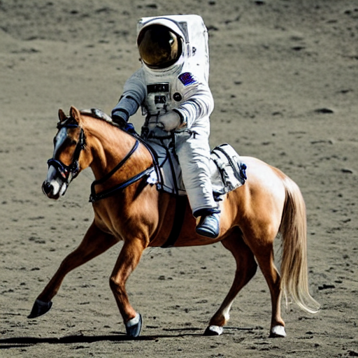
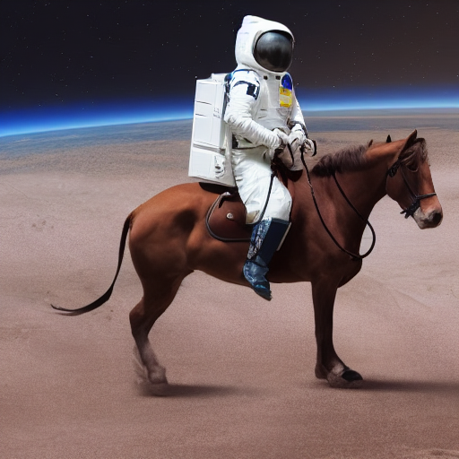
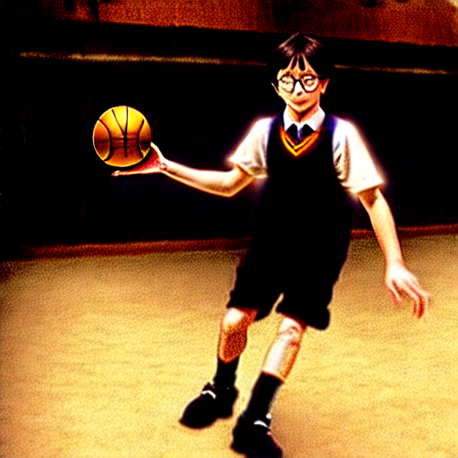

# luna
text to image generation with stable diffusion

# usage
### use venv
```
//create venv
python3 -m venv venv

//activate venv
source venv/bin/activate
```

### clone repo
```
git clone git@github.com:slowy07/luna.git
pip install -r requirements.txt
```

### run script
```
python text2image.py --prompt="example text"
```
to change the output file name run using the `--output` flag
```
python text2image.py --prompt="cool picture" --output="cool_pic.png"
```


###  install as python package
```
pip install git+https://github.com/slowy07/luna
```
and run the package using
```python
from stable_diffusion_tensorflow.stable_diffusion import Text2Image

generator = Text2Image(img_height=512, img_width=512, jit_compose=False)
img = generator.generate(
  "DSLR photograph of an astronut ridinga horse",
  num_steps = 50,
  unconditional_guidance_scale = 75,
  temperature = 1,
  batch_size = 1,
)
```

### ⚠️ NOTE ⚠️
if pip encountered an issue, try running pip with higher privilege using `sudo`

# output

```python
img = generator.generate(
  "DSLR photograph of an astronut ridinga horse",
  num_steps = 50,
  unconditional_guidance_scale = 75,
  temperature = 1,
  batch_size = 1,
)
```
output:

| description | image |
| ------ | ----- |
| prompt: DSLR photograph of an astronut ridinga horse |  |
| prompt: DSLR photograph of an astronut ridinga horse with unconditional_guidance_scale 7.5 |  |
| prompt: DSLR photograph of an astronut ridinga horse with unconditional_guidance_scale 7.5 |  |
| prompt: DSLR photograph of an astronut ridinga horse with unconditional_guidance_scale 7.5 |  |

###  other output

```python
image_prompt: str = "Harry potter playing basketball"
img = generator.generate(
  image_prompt,
  num_steps = 50,
  unconditional_guidance_scale = 75,
  temperature = 1,
  batch_size = 1,
)
```

| description | image |
| ------ | ----- |
| prompt: harry potter playing basketball |  |
| prompt: God wearing mask |  |
| prompt: Harry potter random |  |
| prompt: Marilyn monroe with random  art style |  |

---

### donate

[](https://www.buymeacoffee.com/arfyslowy)

