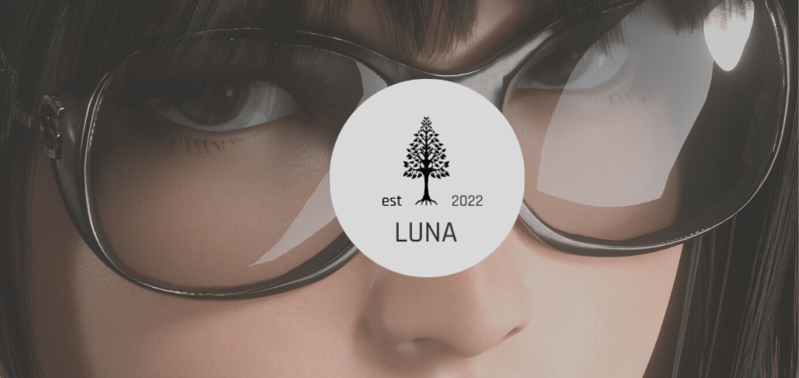
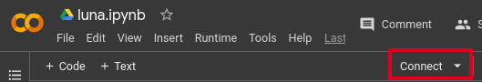
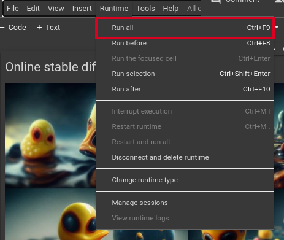
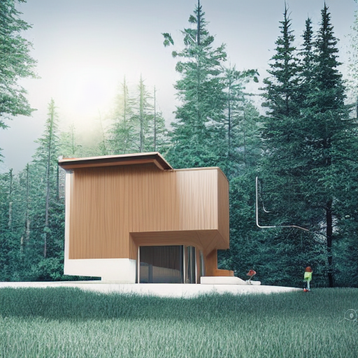
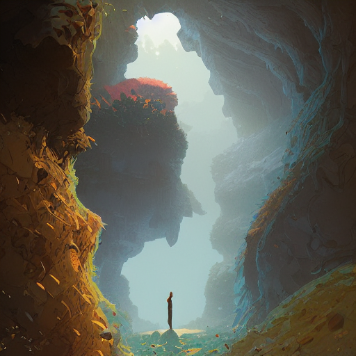
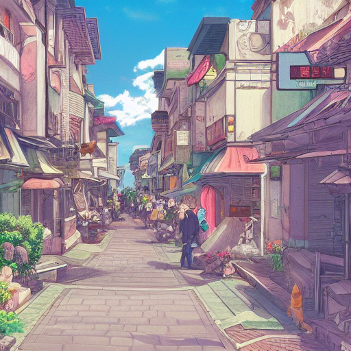

# luna

_<p align="center"> This image background generated with stable diffusion luna</p>_


Stable diffusion is a deep learning, text-to-image model and used to generate detailted images
conditioned on text description, thout it can also be applied to other task such as inpainting or outpainting and 
generate image to image translate guide by text prompt.

**try online on google colab**: 

luna can running on online colab notebook you can check here:

- [luna](https://colab.research.google.com/drive/1IyHaYLCPLRurVs-tJJRLbCcO4kr1xlOi?usp=sharing)
- [luna with gpu and mixed precision](https://colab.research.google.com/drive/1ydFWPt6BgPT7i4VmZcs8ttGaFu7dw-cV?usp=sharing) 
  - 15 seconds generation time per image (512 x 512) on default colab GPU without drop the quality


**usage for online colab**:

- click the connect

  

- open on ``runtime`` and click run all ( ``ctrl+f9`` if using shortcut )
  
  

- online collab running luna


# usage
### use venv
```
//create venv
python3 -m venv venv

//activate venv
source venv/bin/activate
```

### clone repo
clone on https :
```
git clone https://github.com/slowy07/luna
cd luna
pip install -r requirements.txt
```

clone on ssh :
```
git clone git@github.com:slowy07/luna.git
cd luna
pip install -r requirements.txt
```

**note** : if using mac m1 you can try installing the ``requirements_m1.txt``

### run script
```
python text2image.py --prompt="example text"
```
to change the output file name run using the `--output` flag
```
python text2image.py --prompt="cool picture" --output="cool_pic.png"
```


###  install as python package
```
pip install git+https://github.com/slowy07/luna
```
and run the package using
```python
from stable_diffusion_tensorflow.stable_diffusion import StableDiffusion

generator = StableDiffusion(img_height=512, img_width=512, jit_compose=False)
img = generator.generate(
  "DSLR photograph of an astronut riding a horse",
  num_steps = 50,
  unconditional_guidance_scale = 75,
  temperature = 1,
  batch_size = 1,
)
```

you can change dimension of image by change the ``img_height`` and ``img_width``

```python
generator = StableDiffusion(
  img_height = 1020 # or change 1080
  img_height = 1080 # or change 800
)
```

### ⚠️ NOTE ⚠️
if pip encountered an issue, try running pip with higher privilege using `sudo`

# examples

| prompt | image |
| ------ | ----- |
| minimalist house with family, mountainous forested wild, concept art illustration |  |
| natural cave wall, dynamic light, mist low over ground, illustration by josan gonzales and moebius, studio muti, malika favre, rhads, makoto, clean thick line, comics style |  |
| A beautiful ultradetailed anime illustration of a city street, trending on artstation |  |

---

### donate

[](https://www.buymeacoffee.com/arfyslowy)

