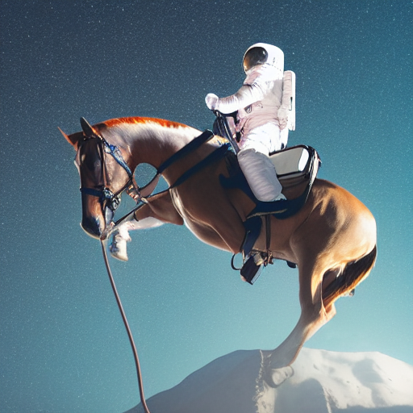
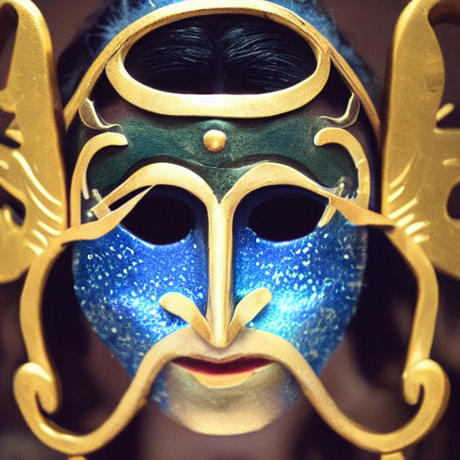
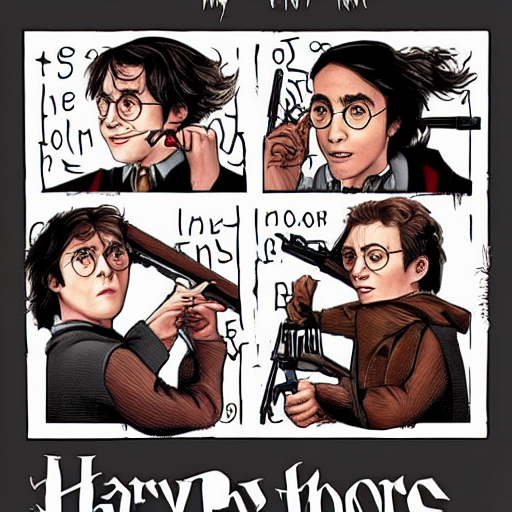
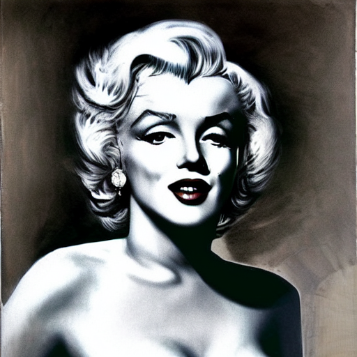

# luna
text to image generation with stable diffusion

# output

```python
img = generator.generate(
  "DSLR photograph of an astronut ridinga horse",
  num_steps = 50,
  unconditional_guidance_scale = 75,
  temperature = 1,
  batch_size = 1,
)
```
output:



###  other output

> God wearing mask



> Harry potter random



> Marilyn monroe with random  art style



